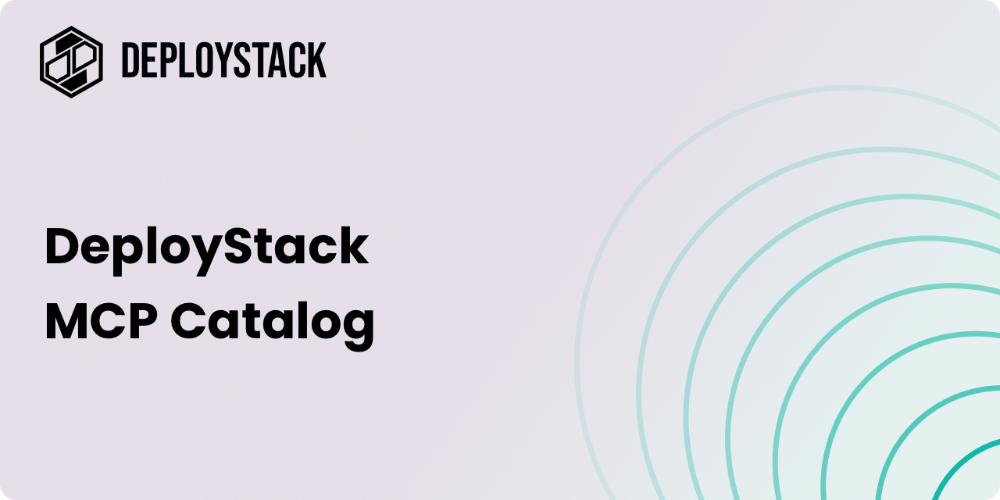

  

# Awesome MCP Server

A community-curated collection of production-ready Model Context Protocol (MCP) servers with standardized configurations. All servers in this catalog are automatically synchronized with [DeployStack](https://cloud.deploystack.io), enabling zero-configuration deployment for teams of any size.

## Table of contents

<!-- TOC_START -->
- [What is this?](#what-is-this)
- [How it works](#how-it-works)
- [How to contribute](#how-to-contribute)
- [Community](#community)
- [MCP Servers](#mcp-servers)
  - [analyze](#analyze)
  - [Museum](#museum)
  - [OpenAPI](#openapi)
- [License](#license)
<!-- TOC_END -->

## What is this?

awesome-mcp-server is the community-driven catalog that powers [DeployStack's MCP Server Catalog](https://cloud.deploystack.io). When you contribute an MCP server here, it becomes available to thousands of developers worldwide through DeployStack's enterprise control plane.

This repository bridges the gap between individual MCP servers and enterprise-ready deployment infrastructure, transforming community contributions into production-ready tools with secure credential management and zero-configuration setup.

## How it works

1. **Contribute**: Add your MCP server to this repository via pull request
2. **Automatic Sync**: Your server is automatically synchronized to the [DeployStack catalog](https://cloud.deploystack.io)
3. **Enterprise Ready**: Teams can instantly deploy your server with zero configuration
4. **Secure Access**: DeployStack handles all credential management and team permissions
5. **Direct Use**: Developers can also use configurations directly with Claude Desktop or other MCP clients

## How to contribute

We welcome contributions! To add your MCP server:

1. Fork this repository
2. Create a new directory under `servers/` with your MCP server name
3. Add a `mcp-server.md` file with your server configuration
4. Submit a pull request

See [CONTRIBUTING.md](CONTRIBUTING.md) for detailed instructions.

## Community

- Join our [Discord community](https://discord.gg/42Ce3S7b3b)
- Follow us on [Twitter / X](https://x.com/DeployStack)

## MCP Servers

<!-- APPLICATIONS_START -->

### analyze

- [octagon-mcp-server](servers/octogram/) - A free MCP server to analyze and extract insights from public filings, earnings transcripts, financial metrics, stock market data, private market transactions, and deep web-based research within Claude Desktop and other popular MCP clients.

### Museum

- [metmuseum-mcp](servers/metmuseum-mcp/) - Met Museum MCP integration to discover the art collection at The Metropolitan Museum of Art in New York

### OpenAPI

- [quran-mcp-server](servers/quran/) - Quran.com API integration for verse search, translation and tafsir

<!-- APPLICATIONS_END -->

## License

This repository is licensed under the MIT License - see the [LICENSE](LICENSE) file for details.
