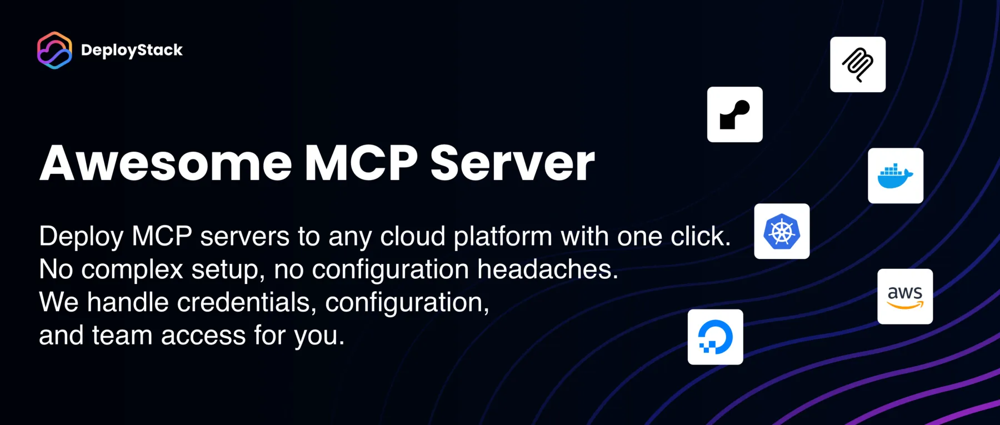

  

# Awesome MCP Server

A curated collection of Model Context Protocol (MCP) servers that can be easily deployed via [DeployStack](https://deploystack.io/mcp).

## Table of contents

<!-- TOC_START -->
- [What is this?](#what-is-this)
- [How it works](#how-it-works)
- [How to contribute](#how-to-contribute)
- [Community](#community)
- [MCP Servers](#mcp-servers)
  - [analyze](#analyze)
- [License](#license)
<!-- TOC_END -->

## What is this?

awesome-mcp-server is a community-driven repository of Model Context Protocol (MCP) servers. Each server is automatically integrated with DeployStack, enabling one-click deployment to multiple cloud platforms.

## How it works

1. Browse the MCP servers in this repository
2. Find a server you want to deploy
3. Click on the DeployStack button to deploy it instantly
4. Or use the configuration directly on your own system with Claude Desktop or other MCP clients

## How to contribute

We welcome contributions! To add your MCP server:

1. Fork this repository
2. Create a new directory under `servers/` with your MCP server name
3. Add a `mcp-server.md` file with your server configuration
4. Submit a pull request

See [CONTRIBUTING.md](CONTRIBUTING.md) for detailed instructions.

## Community

- Join our [Discord community](https://discord.gg/42Ce3S7b3b)
- Follow us on [Twitter / X](https://x.com/DeployStack)
- Check out [DeployStack](https://deploystack.io) for more deployment tools

## MCP Servers

<!-- APPLICATIONS_START -->

### analyze

- [octagon-mcp-server](servers/octogram/) - A free MCP server to analyze and extract insights from public filings, earnings transcripts, financial metrics, stock market data, private market transactions, and deep web-based research within Claude Desktop and other popular MCP clients.

<!-- APPLICATIONS_END -->

## License

This repository is licensed under the MIT License - see the [LICENSE](LICENSE) file for details.
